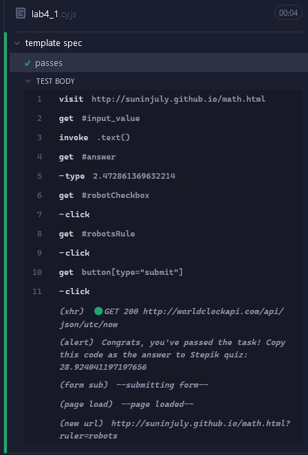
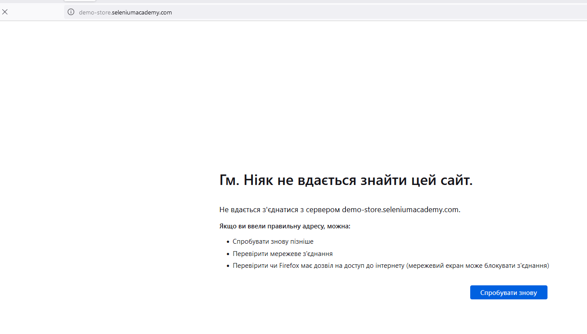

# Fourth lab

First task is done, second is impossible (site is down for at least a week).

## How to use:
- Pull
- Run `npm install` in corresponding directory
- Run `node_modules\.bin\cypress run cypress\e2e\lab4_1.cy.js` to do the magic

## Preview of results (first task):
```console
DevTools listening on ws://127.0.0.1:7209/devtools/browser/78f41796-5d67-4307-bf69-e03247a0e7d6

====================================================================================================

  (Run Starting)

  ┌────────────────────────────────────────────────────────────────────────────────────────────────┐
  │ Cypress:        13.15.2                                                                        │
  │ Browser:        Electron 118 (headless)                                                        │
  │ Node Version:   v21.7.0 (C:\Program Files\nodejs\node.exe)                                     │
  │ Specs:          1 found (lab4_1.cy.js)                                                         │
  │ Searched:       cypress/e2e/**/*.cy.{js,jsx,ts,tsx}                                            │
  └────────────────────────────────────────────────────────────────────────────────────────────────┘


────────────────────────────────────────────────────────────────────────────────────────────────────

  Running:  lab4_1.cy.js                                                                    (1 of 1)


  template spec
    √ passes (4412ms)


  1 passing (8s)


  (Results)

  ┌────────────────────────────────────────────────────────────────────────────────────────────────┐
  │ Tests:        1                                                                                │
  │ Passing:      1                                                                                │
  │ Failing:      0                                                                                │
  │ Pending:      0                                                                                │
  │ Skipped:      0                                                                                │
  │ Screenshots:  0                                                                                │
  │ Video:        true                                                                             │
  │ Duration:     8 seconds                                                                        │
  │ Spec Ran:     lab4_1.cy.js                                                                     │
  └────────────────────────────────────────────────────────────────────────────────────────────────┘


  (Video)

  -  Video output: C:\Users\megak\Desktop\unik\5 year\autotests\lab4\cypress\videos\lab4_1.cy.js.mp4


====================================================================================================

  (Run Finished)


       Spec                                              Tests  Passing  Failing  Pending  Skipped  
  ┌────────────────────────────────────────────────────────────────────────────────────────────────┐
  │ √  lab4_1.cy.js                             00:08        1        1        -        -        - │
  └────────────────────────────────────────────────────────────────────────────────────────────────┘
    √  All specs passed!                        00:08        1        1        -        -        -  
  ```



## Second task is impossible to do, as site `http://demo-store.seleniumacademy.com/` is down
proof:
